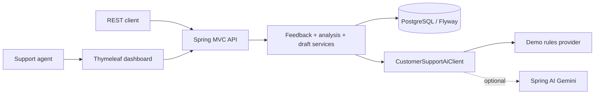

# Generative AI with Java and Spring Boot

This Maven monorepo contains seven Coursera labs, Final Project Part A, and a larger Spring Boot application named `customer-support-platform`.

The main application is a modular monolith with four explicit bounded contexts — feedback intake, analysis, response drafting, and support operations — kept as one deployable by a recorded decision rather than by default. It stores synthetic feedback, analyzes sentiment, category, and urgency, then drafts safe responses for an agent to review. It has a REST API and a server-rendered dashboard. The default `demo` provider uses deterministic rules, so you can run the project without an API key.

That decision, its costs, and a priced plan for extracting microservices are written down: [ADR-0001](docs/adr/0001-modular-monolith-over-microservices.md), the [context map and ubiquitous language](docs/context-map.md), the [decomposition plan](docs/microservice-decomposition.md), and a provider-neutral [cloud deployment topology](docs/cloud-deployment-topology.md).

[](https://github.com/SchwartzLizer/generative-ai-java-spring-labs/actions/workflows/ci.yml)

Course credentials: Coursera *Generative AI for Java and Spring Development* — all graded assessments complete, Final Exam graded at 100%. It's one of 14 courses in the [IBM Java Developer Professional Certificate](https://www.coursera.org/account/accomplishments/specialization/0YH77MIPTE6T), completed 2026-08-28, which also includes coursework in Cloud Native, Microservices, Containers, DevOps and Agile.

## Run the application

You need Java 21 or newer, Docker Desktop, and the Maven Wrapper included in this repository.

On macOS, Linux, or Git Bash/WSL on Windows:

```bash
./start.sh
```

On Windows, from Command Prompt or PowerShell:

```cmd
start.bat
```

The script checks that Docker Desktop is running, creates `.env` from `.env.example` on first run, builds and starts the containers, waits until the app responds on `/actuator/health`, then opens the dashboard in your browser (or prints the URL if it can't). The app keeps running after the script exits; run `docker compose down` when you're done. Run `./start.sh test` (or `start.bat test`) instead to run the full Maven verification, and `./start.sh help` (or `start.bat help`) for usage.

Or run the same steps by hand:

```powershell
copy .env.example .env
docker compose up --build
```

Open `http://localhost:8080/dashboard` and sign in with the credentials from your local `.env` file.

The `demo` provider is active by default. To use Gemini, set `AI_PROVIDER=gemini` and add `GEMINI_API_KEY` to the untracked `.env` file. Keys and prompts are not committed or logged. Provider responses are not logged.

## Review the project in five minutes

1. Read [`docs/architecture.md`](docs/architecture.md) for the request flow, then [ADR-0001](docs/adr/0001-modular-monolith-over-microservices.md) for why this is one deployable and what a microservice split would cost.
2. Run all tests with `./mvnw.cmd --batch-mode --no-transfer-progress verify`.
3. Start the application with `copy .env.example .env; docker compose up --build`.
4. Open `http://localhost:8080/dashboard` and use the credentials from `.env`.
5. Run the synthetic API example below, then open `/swagger-ui.html`.

## What the Spring Boot application covers

| Area | Implementation |
| --- | --- |
| Feedback API | Validated and paginated endpoints, UUID resources, and structured errors |
| AI workflow | Auditable sentiment, category, and urgency analysis, plus response drafts that agents can approve or reject |
| Providers | Deterministic `demo` provider for offline use and an optional Spring AI Gemini adapter |
| Persistence | PostgreSQL, Flyway migrations, append-only analysis and draft history, and `@Version` optimistic locking on feedback and response draft rows |
| Security | `AGENT` access for support workflows and `ADMIN` access for operational endpoints |
| Web interface | Thymeleaf dashboard with summary cards, queue filters, analysis history, and draft history |
| Operations | Health probes, OpenAPI documentation, and correlation IDs |

Approve and reject decisions are final. The application keeps previous analyses and response drafts instead of overwriting them.

Dashboard screenshots come from the manual GitHub Actions workflow in `dashboard-screenshot.yml` after a Docker-capable run. The repository does not include unverified mockups.

## Architecture



See [`docs/architecture.md`](docs/architecture.md) for package ownership, lifecycle transitions, security, and persistence details, and [`docs/context-map.md`](docs/context-map.md) for the bounded contexts, their relationship types, and the boundary violations that currently exist.

## Try the API

The following PowerShell example creates synthetic feedback, runs an analysis, and generates a response draft.

```powershell
$credential = New-Object PSCredential("agent", (ConvertTo-SecureString "agent-local-password" -AsPlainText -Force))
$created = Invoke-RestMethod -Authentication Basic -Credential $credential -Method Post -Uri http://localhost:8080/api/v1/feedback -ContentType 'application/json' -Body '{"customerReference":"CUST-DEMO","message":"The app crashes during checkout"}'
$id = $created.id
Invoke-RestMethod -Authentication Basic -Credential $credential -Method Post -Uri "http://localhost:8080/api/v1/feedback/$id/analyses"
Invoke-RestMethod -Authentication Basic -Credential $credential -Method Post -Uri "http://localhost:8080/api/v1/feedback/$id/response-drafts"
```

API contract: `POST/GET /api/v1/feedback`, `POST /api/v1/feedback/{id}/analyses`, `POST /api/v1/feedback/{id}/response-drafts`, `PATCH /api/v1/response-drafts/{id}/decision`, `GET /api/v1/dashboard/summary`.

## Repository layout

| Area | Path | How to verify it |
| --- | --- | --- |
| Seven course labs | [`labs/`](labs) | `./mvnw.cmd verify` |
| Final Project Part A | [`final-project/part-a-feedback-analyzer`](final-project/part-a-feedback-analyzer) | `./mvnw.cmd -pl final-project/part-a-feedback-analyzer verify` |
| Spring Boot application | [`customer-support-platform`](customer-support-platform) | `./mvnw.cmd -pl customer-support-platform verify` |
| Architecture notes | [`docs/architecture.md`](docs/architecture.md) | Review the Mermaid diagrams |
| Architecture decisions | [`docs/adr/`](docs/adr) | Read ADR-0001 |
| Domain model and contexts | [`docs/context-map.md`](docs/context-map.md) | Compare the glossary against the package names |
| Microservice extraction plan | [`docs/microservice-decomposition.md`](docs/microservice-decomposition.md) | Review the seam table and the saga diagram |
| Cloud topology | [`docs/cloud-deployment-topology.md`](docs/cloud-deployment-topology.md) | Provider-neutral component map |
| Course evidence map | [`docs/coursera-lab-mapping.md`](docs/coursera-lab-mapping.md) | Review the linked repository paths and tests |

## Testing

```powershell
./mvnw.cmd --batch-mode --no-transfer-progress verify
```

This command runs unit tests, Spring context tests, MVC workflow tests, and a PostgreSQL integration test. Testcontainers starts PostgreSQL when Docker is available. GitHub Actions runs the full verification on a Docker-capable runner and also builds the application image. See `.github/workflows/ci.yml`.

## Course attribution and license

The seven lab folders and Final Project Part A are original implementations of learning objectives from Coursera's *Generative AI for Java and Spring Development* — they are not the lab artifacts submitted to Coursera. The mapping document links each objective to repository code and tests.

The course itself is complete: all three modules show every graded assessment finished, and the Final Exam was submitted and graded at 100%. It is one of the 14 courses in the [IBM Java Developer Professional Certificate](https://www.coursera.org/account/accomplishments/specialization/0YH77MIPTE6T), completed 2026-08-28. The same series includes completed coursework in *Spring Framework for Java Development*, *Java Development with Databases*, *Cloud Native, Microservices, Containers, DevOps and Agile*, and *Java: Design Patterns, Testing, and Deployment*.

Original work is licensed under Apache 2.0. Course and framework names remain trademarks of their respective owners.
