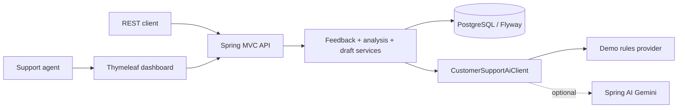

# Generative AI Java & Spring Portfolio

`customer-support-platform` is a modular-monolith portfolio app for support agents: it stores synthetic customer feedback, runs auditable sentiment/category/urgency analysis, drafts safe responses, and exposes both a REST API and a server-rendered dashboard. The default AI provider is deterministic, so the repository is runnable without credentials.

[](https://github.com/SchwartzLizer/generative-ai-java-spring-labs/actions/workflows/ci.yml)

## Five-minute reviewer path

1. Read [`docs/architecture.md`](docs/architecture.md) for the request flow and boundaries.
2. Run the full build: `./mvnw.cmd --batch-mode --no-transfer-progress verify`.
3. Start PostgreSQL and the app with `copy .env.example .env; docker compose up --build`.
4. Open `http://localhost:8080/dashboard` with the credentials in your local `.env`.
5. Try the synthetic API flow below, then inspect `/swagger-ui.html`.

## Flagship features

- Validated, paginated feedback API with UUID resources and structured errors.
- Append-only AI analyses and response drafts; approve/reject decisions are immutable.
- Deterministic `demo` provider for offline evaluation and optional Spring AI Gemini adapter.
- PostgreSQL + Flyway persistence, optimistic locking, health probes, OpenAPI, and correlation IDs.
- Role-based security: `AGENT` workflow access and `ADMIN` operational access.
- Thymeleaf dashboard with summary cards, queue filtering, analysis history, and draft history.

Dashboard screenshots are produced from the manual GitHub Actions workflow (`dashboard-screenshot.yml`) after a Docker-capable run; no unverified mockups are committed.

## Architecture



See [`docs/architecture.md`](docs/architecture.md) for package ownership, lifecycle transitions, security, and persistence details.

## Quick start

Requirements: Java 21+, Docker Desktop, and the committed Maven Wrapper.

```powershell
copy .env.example .env
docker compose up --build
```

The demo provider is active by default. For Gemini, set `AI_PROVIDER=gemini` and `GEMINI_API_KEY` in your untracked `.env` file. Keys and prompts are never committed or logged.

## Synthetic API example

```powershell
$credential = New-Object PSCredential("agent", (ConvertTo-SecureString "agent-local-password" -AsPlainText -Force))
$created = Invoke-RestMethod -Authentication Basic -Credential $credential -Method Post -Uri http://localhost:8080/api/v1/feedback -ContentType 'application/json' -Body '{"customerReference":"CUST-DEMO","message":"The app crashes during checkout"}'
$id = $created.id
Invoke-RestMethod -Authentication Basic -Credential $credential -Method Post -Uri "http://localhost:8080/api/v1/feedback/$id/analyses"
Invoke-RestMethod -Authentication Basic -Credential $credential -Method Post -Uri "http://localhost:8080/api/v1/feedback/$id/response-drafts"
```

API contract: `POST/GET /api/v1/feedback`, `POST /api/v1/feedback/{id}/analyses`, `POST /api/v1/feedback/{id}/response-drafts`, `PATCH /api/v1/response-drafts/{id}/decision`, `GET /api/v1/dashboard/summary`.

## Repository map

| Area | Path | Evidence command |
| --- | --- | --- |
| Seven course labs | [`labs/`](labs) | `./mvnw.cmd verify` |
| Final Project Part A | [`final-project/part-a-feedback-analyzer`](final-project/part-a-feedback-analyzer) | `./mvnw.cmd -pl final-project/part-a-feedback-analyzer verify` |
| Flagship Spring Boot app | [`customer-support-platform`](customer-support-platform) | `./mvnw.cmd -pl customer-support-platform verify` |
| Architecture | [`docs/architecture.md`](docs/architecture.md) | review Mermaid diagrams |
| Course evidence map | [`docs/coursera-lab-mapping.md`](docs/coursera-lab-mapping.md) | repository paths + tests |

## Provider and test notes

```powershell
./mvnw.cmd --batch-mode --no-transfer-progress verify
```

The local verification includes unit tests, Spring context tests, MVC workflow tests, and a Testcontainers integration test. On this workstation Docker is not installed, so the PostgreSQL container test is intentionally skipped locally; GitHub Actions runs it on a Docker-capable runner. See `.github/workflows/ci.yml`.

## Course attribution and license

The seven lab folders and Final Project Part A are original implementations of the learning objectives from Coursera's *Generative AI for Java and Spring Development*. The mapping document records repository evidence and does not claim Coursera grading or submission state. Original work is licensed under Apache 2.0; course and framework names remain their respective owners' trademarks.
