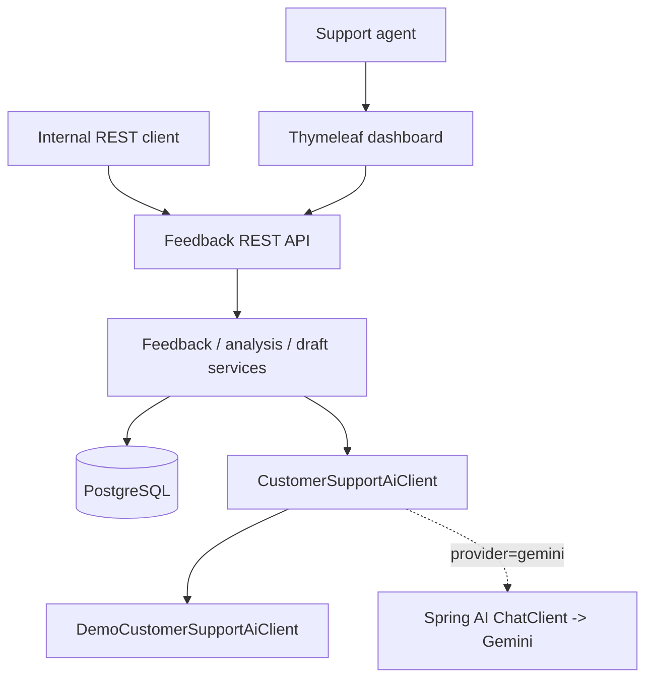
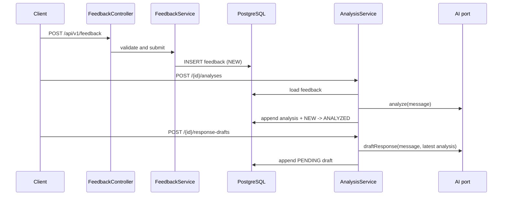

# Customer Support Platform Architecture

## System context

## Request flow

## Package ownership

Packages are named by technical concern. Their domain meaning, the relationships between them, and the boundary violations that currently exist are in [`context-map.md`](context-map.md).

| Package | Responsibility |
| --- | --- |
| `feedback` | Feedback entity, lifecycle, validation DTOs, repository, REST and page controllers |
| `analysis` | Analysis entity, enums, AI analysis workflow, response DTO |
| `response` | Draft entity, approve/reject lifecycle, generation workflow |
| `dashboard` | Count queries, summary DTO, REST and Thymeleaf dashboard |
| `ai` | Narrow provider port, deterministic demo rules, safe prompts, Gemini adapter |
| `security` | In-memory AGENT/ADMIN users, Basic API auth, form-login dashboard policy |
| `common` | Errors, correlation ID filter, clock/UUID beans, OpenAPI metadata |

## State and persistence

Feedback transitions are `NEW -> ANALYZED|IN_PROGRESS`, `ANALYZED -> IN_PROGRESS`, `IN_PROGRESS -> RESOLVED`, and `RESOLVED -> IN_PROGRESS|CLOSED`. `CLOSED` is terminal. Drafts start `PENDING` and can be decided exactly once. Flyway owns `feedback`, `feedback_analysis`, and `response_draft`; analysis and draft rows are append-only and reference feedback with `ON DELETE CASCADE`.

## AI and security boundaries

`CustomerSupportAiClient` keeps domain services independent from transport. The demo provider is deterministic and active by default. The Gemini adapter parses a strict JSON analysis contract and uses bounded prompts that prohibit invented refunds, dates, account actions, or policy claims. Provider errors become structured `503` responses without deleting feedback.

`/api/**` uses HTTP Basic and `/dashboard` uses form login. `AGENT` and `ADMIN` can run support workflows; only `ADMIN` can read non-health Actuator information. Liveness/readiness are public. Correlation IDs are returned in `X-Correlation-ID` and placed in MDC only for the request duration. Request bodies, credentials, prompts, and provider responses are not logged.

## Related decisions

Why this is one deployable, and what splitting it would cost: [ADR-0001](adr/0001-modular-monolith-over-microservices.md) and [`microservice-decomposition.md`](microservice-decomposition.md).
