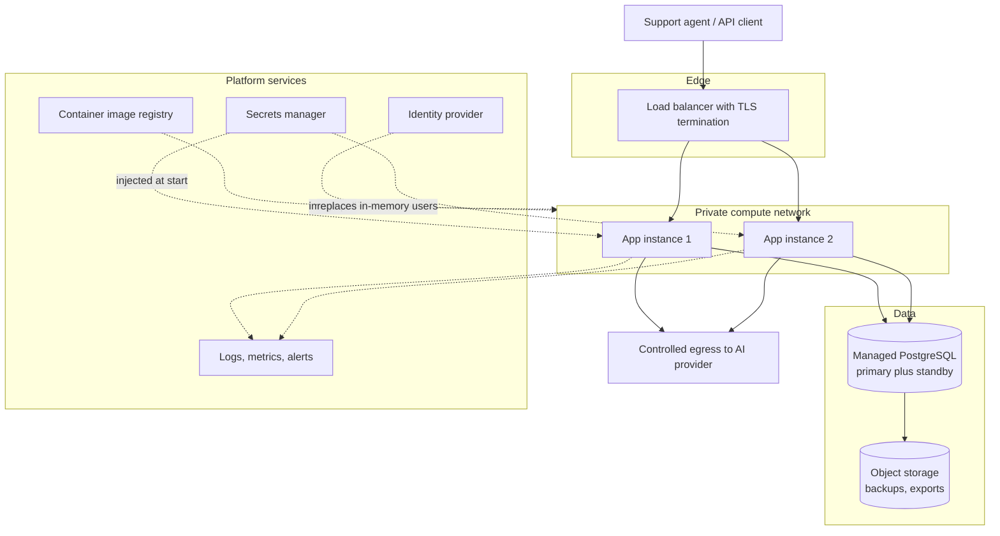

# Cloud Deployment Topology

**Provider-neutral by design.** This document names component *categories* and the
use case each serves, so the same design maps onto any major cloud. Naming a
specific provider's services would date the document and hide the reasoning.

**Nothing here is deployed.** The repository is container-ready and stops there,
which was a deliberate scope choice. This document describes what a production
deployment would require and — just as importantly — what would have to change in
the code first.

## What already exists, and what it buys in a cloud

The application was built container-first, so several cloud prerequisites are
already satisfied rather than aspirational:

| Existing | Where | Why it matters in a cloud |
| --- | --- | --- |
| Multi-stage image, JRE-only runtime | `customer-support-platform/Dockerfile` lines 1–13 | Small image, faster pulls, smaller attack surface |
| Non-root runtime user, uid 10001 | `Dockerfile` lines 7 and 10 | Most managed container platforms reject or flag root containers |
| Container-aware heap sizing | `Dockerfile` line 12, `MaxRAMPercentage=75` | The JVM respects the container memory limit instead of the host's |
| Liveness and readiness probes | `application.yml` lines 15–16 | Orchestrators need them to route traffic and restart safely |
| Configuration entirely from environment | `application.yml` lines 4–6 and 17–26, `compose.yaml` lines 24–34 | No rebuild per environment; secrets stay outside the image |
| Schema migration on startup | Flyway enabled at `application.yml` line 10, with `ddl-auto: validate` at line 8 | Deployments carry their own schema change |
| `open-in-view: false` | `application.yml` line 9 | Database connections are released before view rendering; protects the pool under load |
| Correlation ID on every request | `common/CorrelationIdFilter`, returned as `X-Correlation-ID` | The minimum needed to follow one request through aggregated logs |

## Component categories and one use case each

**Managed container runtime.** Runs the image from
`customer-support-platform/Dockerfile` with a CPU and memory limit, a replica
count, and a rolling deployment strategy. *Use case:* the readiness probe already
exposed at `/actuator/health` lets the platform hold traffic off an instance until
Flyway has finished and the datasource is up, so a deployment causes no failed
requests.

**Managed relational database.** PostgreSQL 17 with automated backups,
point-in-time recovery, and a standby in a second availability zone. *Use case:*
`feedback_analysis` and `response_draft` are append-only audit history
(`V1__create_support_tables.sql` lines 13–40) — losing them loses the record of
what the AI proposed and what a human decided, so restorability is the reason this
is managed rather than self-run.

**Secrets manager.** Holds the database password and the AI provider API key,
injected as environment variables at start. *Use case:* every credential the
application needs is already read from the environment rather than compiled in —
the database password at `application.yml` line 6, passed through at
`compose.yaml` line 27, and the AI provider key deliberately kept in an untracked
local `.env` file rather than the repository (`README.md`, "Run the application" section). Because
nothing is baked into the image and prompts, credentials, and provider responses
are never logged, rotating a secret is a restart rather than a code change. A
secrets manager replaces the local `.env` convention with one that is auditable
and revocable.

**Container image registry with vulnerability scanning.** *Use case:* CI already
builds the image (`.github/workflows/ci.yml` line 23); the registry is where that
artifact becomes immutable and scannable, so the exact bytes that passed CI are
the bytes that run.

**Load balancer with TLS termination.** *Use case:* the application serves plain
HTTP on 8080 (`compose.yaml` line 23) and uses HTTP Basic on `/api/**` — the
`httpBasic` call in `SecurityConfiguration.securityFilterChain()`. Basic
credentials over anything but TLS
are credentials in the clear, so terminating TLS at the edge is a requirement, not
an optimisation.

**Object storage.** *Use case:* database backup destination and the natural home
for long-term exports of analysis history, which grows monotonically and does not
belong in the transactional database forever.

**Log aggregation, metrics, and alerting.** *Use case:* every response carries a
correlation ID; aggregation is what turns that from a header into the ability to
reconstruct one agent's session across instances. The first alert worth having is
on the AI provider failure path, which surfaces as a `503` from
`AiProviderException`.

**Controlled egress.** *Use case:* when `AI_PROVIDER=gemini`, the application makes
outbound calls to a third party. A single controlled egress path gives one place
to observe, rate-limit, and restrict them.

**Identity provider.** *Use case:* replaces the two in-memory users built in
`SecurityConfiguration.userDetailsService()`, which are a local-development
convenience and must not reach production.

## Scaling and its one real blocker

The API path is stateless: `/api/**` uses HTTP Basic via the `httpBasic` call in
`SecurityConfiguration.securityFilterChain()`, and no request state is held
between calls, so API traffic scales by
adding instances behind the load balancer.

**The dashboard is not stateless.** The `formLogin` call in
`SecurityConfiguration.securityFilterChain()` creates an HTTP session. With more than one instance this
requires either session affinity at the load balancer or an external session
store. This is a genuine limitation of the current code, not a deployment detail,
and it is the first thing to fix before scaling horizontally.

Second concern: Flyway runs at application startup. With multiple replicas
deploying at once, migrations must be safe under concurrent start — Flyway takes a
lock, but the deployment strategy should still be verified against it rather than
assumed.

Likely first bottleneck under load is not the database but the `aiClient.analyze`
call in `FeedbackAnalysisService.analyze()`: a synchronous external call whose
latency is set by the provider, not by this system. It no longer holds a database
connection while it waits — the feedback is loaded in one transaction, the provider
is called with none open, and the result is persisted in a second. That was the
first performance change worth making, and it cost nothing in infrastructure. The
call is now wrapped in an `ai.provider.call.duration` timer and bounded by
`app.ai.timeout` (`AI_TIMEOUT`, default ten seconds), so provider latency is both
measurable and capped rather than unbounded.

## Cost drivers

Rough, provider-neutral, and ranked rather than priced — any figure in currency
would be a guess dressed as a fact:

1. **Always-on compute.** Dominated by replica count multiplied by instance size.
   Two small instances is the practical minimum for availability.
2. **The managed database.** A standby for high availability roughly doubles the
   database line item; it is the single largest optional cost.
3. **AI provider usage.** Per-call and outside the infrastructure budget entirely.
   The deterministic demo provider is the default (`application.yml` line 19), so
   this cost is opt-in.
4. **Log retention.** Cheap until it is not; retention policy is the control.
5. **Data transfer and storage.** Negligible at this system's volume.

## What must change before this could be deployed

Stated plainly, because a topology diagram that omits the gaps is a sales
document:

1. **In-memory users must be replaced** by a real identity provider.
2. **Session handling must be solved** for the form-login dashboard before running
   more than one instance.
3. **Only `health` and `info` are exposed** (`application.yml` line 15) — metrics
   would need enabling and protecting, since `/actuator/**` is already
   `ADMIN`-only under the request matchers in
   `SecurityConfiguration.securityFilterChain()`.
4. **Correlation IDs are not distributed tracing.** Adequate for one deployable;
   inadequate the moment there is more than one.
5. **No load testing has been performed.** Every scaling statement above is
   reasoning from the code, not measurement, and is labelled as such.
