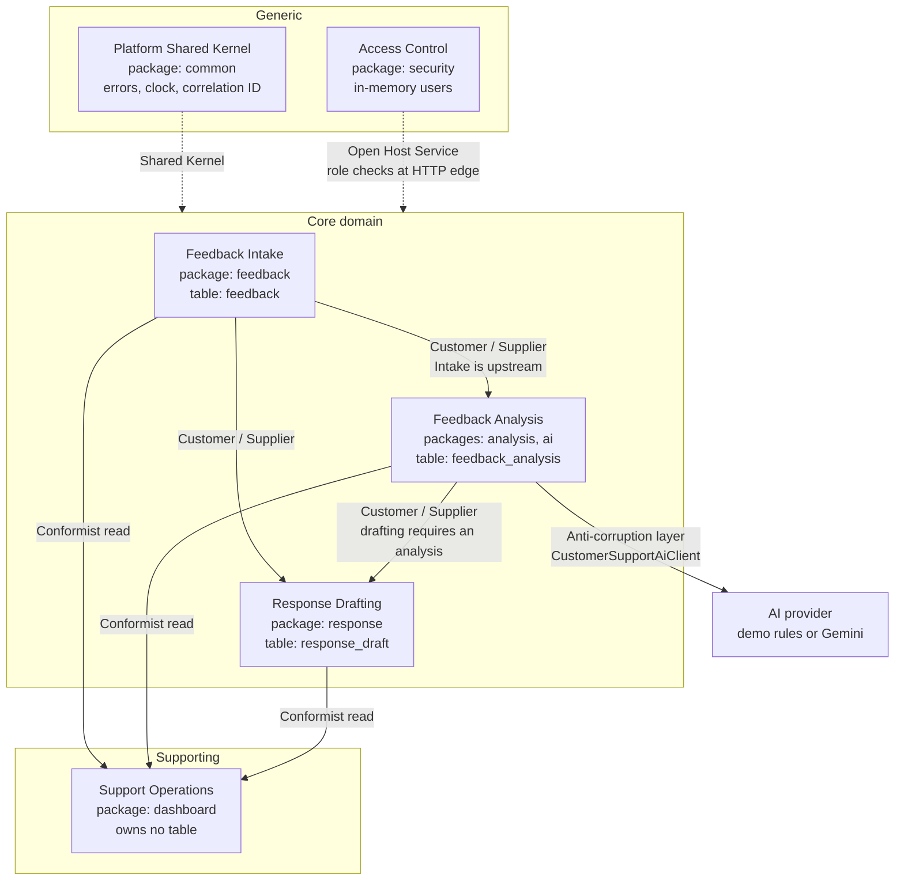

# Context Map and Ubiquitous Language

This document names the bounded contexts inside `customer-support-platform`, the
relationships between them, the shared vocabulary, and — honestly — the places
where the current code crosses its own boundaries.

The system is one deployable by choice. See
[ADR-0001](adr/0001-modular-monolith-over-microservices.md) for why, and
[`microservice-decomposition.md`](microservice-decomposition.md) for what
extraction would cost.

## The map

## Bounded contexts

| Context | Package | Owns | Aggregate root and its invariant |
| --- | --- | --- | --- |
| **Feedback Intake** | `com.schwartzlizer.support.feedback` | `feedback` table | `Feedback`. Enforces a lifecycle state machine inside the aggregate in `Feedback.changeStatus()`, and concurrency via the `@Version` `version` field. |
| **Feedback Analysis** | `...support.analysis`, `...support.ai` | `feedback_analysis` table | `FeedbackAnalysis`. Immutable after creation: constructed only through the validating factory `FeedbackAnalysis.create()`, with no mutator. History is append-only. |
| **Response Drafting** | `...support.response` | `response_draft` table | `ResponseDraft`. Decide-once, protected at two levels: the private `ResponseDraft.decide()` rejects a second decision within a transaction, and the `@Version` `version` field rejects a concurrent decision from another transaction. History is append-only. |
| **Support Operations** | `...support.dashboard` | nothing | Read model only. Derives counts and a queue view; holds no state and no invariant. |
| **Access Control** | `...support.security` | nothing | Authenticates and authorises at the HTTP edge. Two roles, `AGENT` and `ADMIN`, defined in `SecurityConfiguration.userDetailsService()`. |
| **Platform Shared Kernel** | `...support.common` | nothing | Error shape, correlation ID propagation, `Clock` and UUID suppliers (the `applicationClock()` and `uuidSupplier()` beans in `CommonConfiguration`). Deliberately domain-free. |

## Relationship types

- **Feedback Intake → Feedback Analysis — Customer / Supplier.**
  Analysis cannot exist without a feedback message; `FeedbackAnalysisService.analyze()`
  loads the `Feedback` aggregate before doing anything else. Intake is
  upstream and does not know analysis exists in its own service logic.

- **Feedback Intake and Feedback Analysis → Response Drafting — Customer /
  Supplier.** Drafting is downstream of both:
  `ResponseDraftService.generate()` reads the feedback message and the most
  recent analysis, and rejects the request with `AnalysisRequiredException`
  when no analysis exists.

- **All three → Support Operations — Conformist.** The dashboard reads the other
  contexts' models as they are and translates nothing;
  `DashboardService.summary()` consumes their repositories and enums
  directly. This is a deliberate conformist relationship for a read model, not an
  accident — but it is the reason the dashboard is the hardest thing to split.

- **Feedback Analysis → AI provider — Anti-corruption layer.**
  `CustomerSupportAiClient` — two methods, `analyze` and `draftResponse` — is a
  narrow port that keeps the vendor model out of the domain. Two adapters
  implement it: the deterministic `DemoCustomerSupportAiClient` and the
  Spring AI `GeminiCustomerSupportAiClient`. Domain services never see a vendor
  type. This is the cleanest boundary in the system.

- **Platform Shared Kernel → all — Shared Kernel.** Small and stable on purpose.
  Growth here should be treated as a design smell.

- **Access Control → all — Open Host Service.** Enforced by the request matchers in
  `SecurityConfiguration.securityFilterChain()` rather than by domain code, so contexts
  stay unaware of authentication.

## Ubiquitous language

| Term | Meaning in this system | Where it lives in code |
| --- | --- | --- |
| **Feedback** | One synthetic customer message under review. The unit of work for the whole platform. | `Feedback` |
| **Customer reference** | An opaque external identifier for the customer. Never a real person; the data is synthetic. | `Feedback.customerReference` |
| **Feedback status** | Where a piece of feedback sits in its lifecycle: `NEW`, `ANALYZED`, `IN_PROGRESS`, `RESOLVED`, `CLOSED`. `CLOSED` is terminal. | `FeedbackStatus` |
| **Analysis** | One immutable, attributed judgement about a feedback message. Never overwritten; a new analysis is appended. | `FeedbackAnalysis` |
| **Sentiment** | `POSITIVE`, `NEUTRAL`, or `NEGATIVE`. | `Sentiment` |
| **Support category** | `SECURITY`, `BILLING`, `TECHNICAL`, `DELIVERY`, or `GENERAL`. Determines routing. | `SupportCategory` |
| **Urgency** | `HIGH`, `MEDIUM`, or `LOW`. Drives the "urgent" count on the dashboard. | `Urgency` |
| **Recommended action** | The routing instruction produced with an analysis. Advice to an agent, never an automated action. | `FeedbackAnalysis.recommendedAction` |
| **Response draft** | Proposed reply text awaiting a human decision. Never sent by the system. | `ResponseDraft` |
| **Draft decision** | `PENDING`, `APPROVED`, or `REJECTED`. Can be set exactly once. | `DraftDecision` |
| **Provider / model** | Which AI implementation produced an analysis or draft, recorded on every row for auditability. | `provider`, `model` columns |
| **Agent** | A human who reviews feedback and decides on drafts. Role `AGENT`. | `SecurityConfiguration` |
| **Admin** | An agent who may additionally read operational endpoints. Role `ADMIN`. | `SecurityConfiguration` |
| **Correlation ID** | Per-request identifier returned as `X-Correlation-ID`, held in the logging context only for the request duration. | `CorrelationIdFilter` |

Two rules the language encodes and the code enforces: **history is appended, never
overwritten**, and **the system drafts, it never sends**.

## Known boundary violations

These are real and currently unenforced. They are listed because a context map
that only describes the intended design is marketing, not documentation.

1. **The API response type reaches across three contexts.**
   The `FeedbackResponse` record in the `feedback` package imports
   `analysis.FeedbackAnalysisResponse` and `response.ResponseDraftResponse` and
   carries both as fields. Intake's public contract is defined partly by its
   downstream contexts.

2. **`FeedbackService` holds two foreign repositories.**
   Its `@Autowired` constructor injects `FeedbackAnalysisRepository` and
   `ResponseDraftRepository`, and `FeedbackService.get()` composes all three.
   This is API composition living inside a domain service. The secondary
   three-argument constructor, which passes `null` for both foreign repositories
   and forces null checks inside `get()`, is a direct symptom.

3. **The AI adapter speaks the analysis context's language.**
   `DemoCustomerSupportAiClient` imports `com.schwartzlizer.support.analysis.*`,
   and its `analyze` method returns `Sentiment`, `SupportCategory`, and
   `Urgency`. Defensible while `ai` and `analysis` are one
   context; a wire contract would be required if they ever separate.

4. **Child entities hold object references to another context's aggregate.**
   `FeedbackAnalysis` and `ResponseDraft` each map a `feedback` field as
   `@ManyToOne ... private Feedback feedback`. DDD guidance is to reference other
   aggregates by identity. The database column is already `feedback_id UUID`, so
   correcting this is a mapping change, not a schema change — it would also
   require renaming the derived queries `findByFeedback_IdOrderByCreatedAtAsc`
   and `findTopByFeedback_IdOrderByCreatedAtDesc` on `FeedbackAnalysisRepository`,
   and `findByFeedback_IdOrderByCreatedAtAsc` on `ResponseDraftRepository`.

5. **Nothing enforces any of the above.** These boundaries are conventions. The
   build passes regardless. Adding architecture tests that fail the build on an
   illegal cross-context import is the recommended next step and is deliberately
   **not** implemented today; it would be the first item of work if this map is
   ever promoted from documentation into a constraint.
