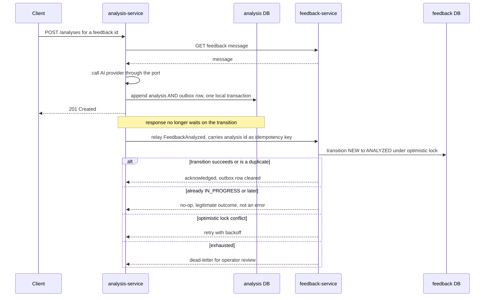
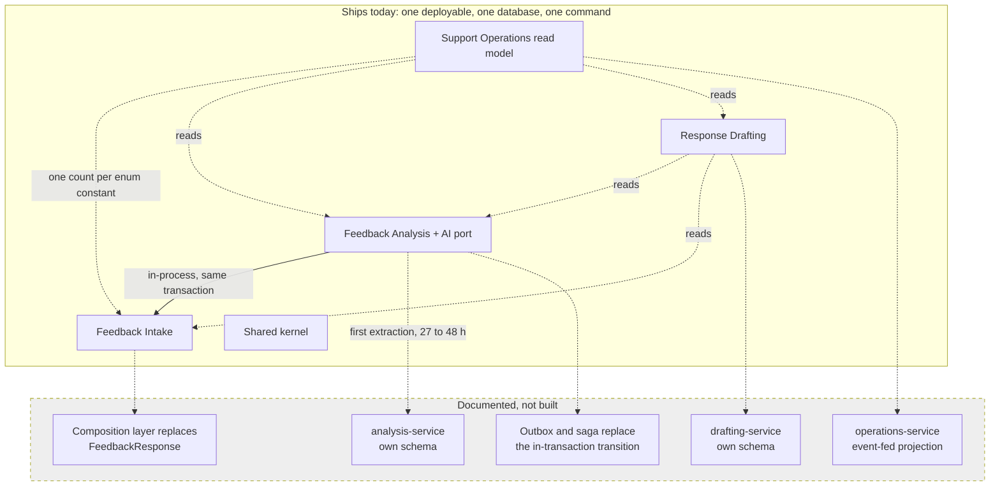

# Microservice Decomposition Plan

**This is a plan, not a build.** The system ships as one deployable; see
[ADR-0001](adr/0001-modular-monolith-over-microservices.md). This document exists
so that extraction is a scheduling decision with a known price rather than a
discovery exercise. Contexts and vocabulary are defined in
[`context-map.md`](context-map.md).

## Candidate services and data ownership

| Service | From | Would own | Would need from others |
| --- | --- | --- | --- |
| `feedback-service` | `feedback` | `feedback` table, including the `version` column at `V1__create_support_tables.sql` line 8 | Nothing. It is the upstream. |
| `analysis-service` | `analysis` + `ai` | `feedback_analysis` | Feedback message text; ability to request a status transition |
| `drafting-service` | `response` | `response_draft` | Feedback message text; latest analysis |
| `operations-service` | `dashboard` | A projection, not a source of truth | Counts from all three |

The foreign keys at `V1__create_support_tables.sql` lines 15 and 31 —
`REFERENCES feedback(id) ON DELETE CASCADE` on both child tables — would have to
be dropped. Referential integrity and orphan cleanup move into application code.
Keeping one database instead would ship the shared-database anti-pattern, which is
a worse outcome than not splitting.

## Per-seam cut cost

| Seam | Difficulty | Why |
| --- | --- | --- |
| `common` → shared library | **Easy** | No domain content. New Maven module plus a version-coupling policy. |
| `ai` staying inside analysis | **Free** | `CustomerSupportAiClient` is already a port. `DemoCustomerSupportAiClient` imports the analysis enums, which is fine only while the two stay together. |
| Entity references → IDs | **Low** | `FeedbackAnalysis` and `ResponseDraft` each map a `feedback` field as `@ManyToOne Feedback`. Replace with `UUID feedbackId`; update the `create` factory on each, and the derived queries `findByFeedback_IdOrderByCreatedAtAsc` and `findTopByFeedback_IdOrderByCreatedAtDesc` on the two repositories. No schema change needed — the column is already a UUID. |
| API composition | **Medium** | The `FeedbackResponse` record and `FeedbackService.get()` compose three contexts. Becomes a gateway or backend-for-frontend. |
| Access control | **Medium** | One `InMemoryUserDetailsManager`, built in `SecurityConfiguration.userDetailsService()`, does not span processes. Requires propagated credentials or token issuance. |
| Drafting's two upstream reads | **Hard** | `ResponseDraftService.generate()` reads feedback and the latest analysis in one transaction, and enforces "analysis must exist". Across services this becomes two remote reads and a racy invariant. |
| Dashboard read model | **Hard** | `DashboardService.summary()` fans one count query per domain-enum constant across three repositories in one read transaction, so the query count grows with the model; `DashboardPageController.dashboard()` additionally joins those counts with a filtered, sorted, paginated query. Requires an event-fed projection. Cross-service pagination has no cheap correct answer. |
| **Analyze transaction** | **Hardest** | See below. |

## The one hard seam: `FeedbackAnalysisService.analyze()`

`FeedbackAnalysisService.analyze()` loads the feedback, calls the AI provider with
no transaction open, then appends a `feedback_analysis` row and — only when the
feedback is still `NEW` — transitions it to `ANALYZED`, both writes in one
transaction. The
transition is protected by the aggregate's own state machine in
`Feedback.changeStatus()` and by the `@Version` `version` field on `Feedback`.

Today a conflict rolls both writes back together. Split, the analysis row is
already committed when the remote transition is attempted, and there is nothing to
roll back into. The proposed replacement:

Design rules this implies, all of which are currently free and would stop being
free:

- **Idempotency.** The analysis id becomes the key; the transition must be safe to
  replay. Today the `NEW` status check and both writes happen in the same
  transaction, so the operation is naturally idempotent.
- **No compensation for the analysis.** History is append-only by design, so a
  failed transition must never delete an analysis. The failure mode is a feedback
  row that stays `NEW` while an analysis exists — which must be detectable and
  reconcilable.
- **A "later status wins" rule.** `Feedback.changeStatus()` throws on an illegal
  transition. Arriving late at an already-advanced aggregate is a
  no-op, not an exception.
- **The 201 stops meaning what it means today.** Currently the response implies
  both writes are durable. After the split it implies only the analysis is.

## Target state

## Effort, as a rough estimate

| Scope | Rough estimate |
| --- | --- |
| Extract `analysis-service` only | **27–48 h** |
| Full four-service split | **70–120 h** |

Assumptions: one developer already fluent in this codebase; **no prior production
microservices experience**, so first-time learning cost is included; Docker
Desktop on Windows. Excluded: cloud provisioning, orchestration, message-broker
operations, distributed tracing backends, load testing.

What blows the estimate: compatibility between the pinned Spring Boot 4.1.1
(`pom.xml` line 31) and any Spring Cloud gateway or discovery component is
unverified, and could add 8–16 hours with a genuine chance of a dead end.

The cost is not moving code — the platform is small. It is the saga, the read
model, inter-service authentication, and the test rebuild.

## What the split would cost that is easy to forget

- **The `supportsFeedbackAnalysisDraftAndSummaryFlow` test in `SupportWorkflowIntegrationTest`** proves submit → analyze →
  draft → summary over real HTTP in one class. It cannot survive a split. The
  replacement is per-service slices plus a multi-container end-to-end test.
- **`compose.yaml`** grows from one app and one database to N of each, with
  startup ordering and roughly 2–3 GB of RAM on a developer laptop.
- **`.github/workflows/ci.yml`** line 21 is one `verify` and line 23 is one image
  build. Both multiply.
- **The five-minute review promise** in the "Review the project in five minutes"
  section of `README.md` is the repository's strongest asset. A split trades a
  proven strength for an unproven one.

## Recommended sequence, if it is ever done

1. Enforce the boundaries in the existing monolith first: replace the
   `@ManyToOne` references with IDs, move composition out of `FeedbackService`,
   introduce an in-process domain event where the saga would go, and add
   architecture tests that fail the build on illegal imports. Nothing distributed
   yet, and every step is independently valuable.
2. Extract `analysis-service` only, with its own schema and the outbox above.
3. Reassess. Steps 1 and 2 will have taught more than this document can.
